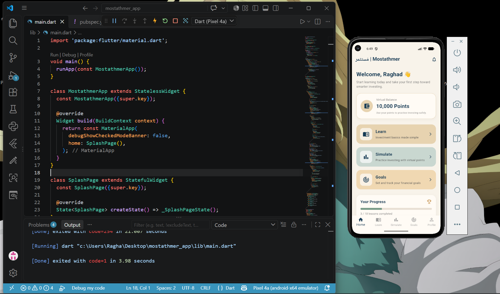
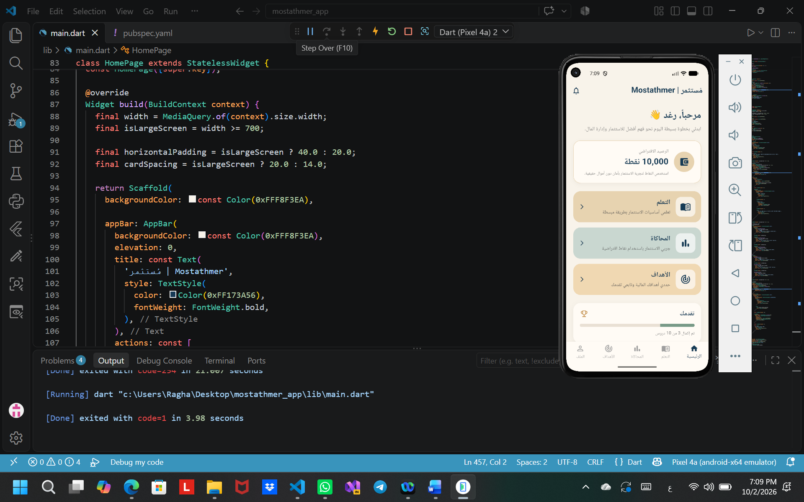
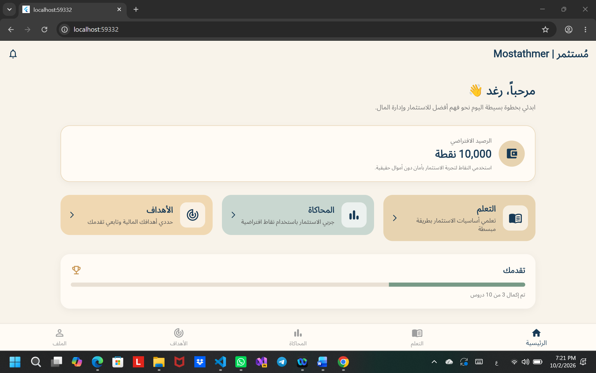

# Mostathmer

# An educational app that simplifies the basics of investing and money management through learning and simulation with virtual money.

# HomePage

## Flutter Code

The HomePage source code is available in:

`lib/main.dart`

## Day 3 - Responsive RTL HomePage

The HomePage was improved to support Arabic RTL and different screen sizes.

### Mobile View

### Large Screen View

### Code
The Day 3 Flutter code is available in:

`lib/day3_main.dart`
### Day 4 — Navigation & Routes

Improved the application by adding multiple connected screens and organized navigation between them.

Implemented:

- Multiple screens
- `Navigator`
- `Navigator.pushNamed`
- `Navigator.pop`
- Named Routes
- Passing data between screens
- Organized screen files inside the `screens` folder
- Login screen with dynamic user name
- Learn, Simulation, Goals, and Course Details screens

File:
`lib/day4_main.dart`

Screen files:
`lib/screens/`

Application Flow:

`Login → Home → Learn → Course Details`

Additional Routes:

`Home → Simulation`

`Home → Goals`
